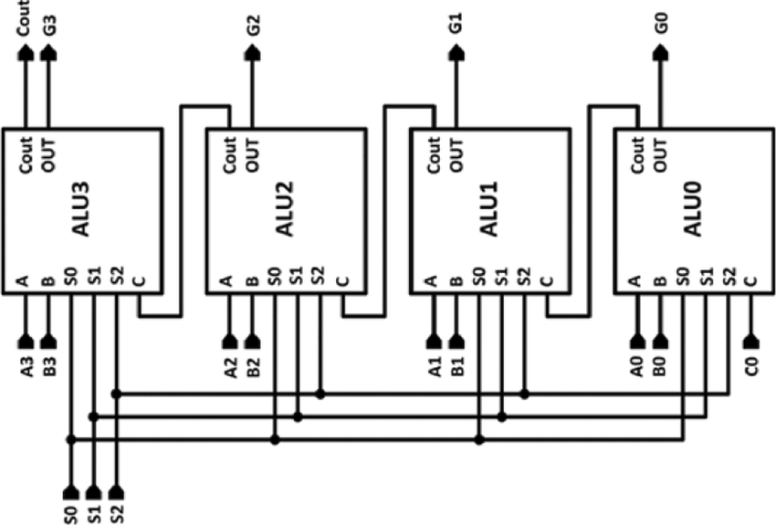
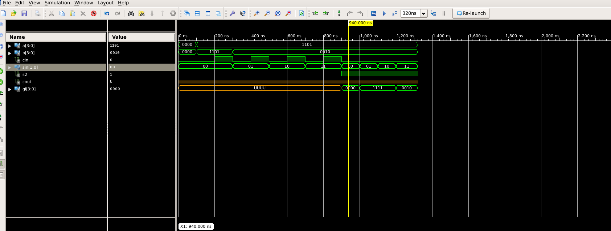

<h1 align = "center">Four Bit ALU</h1>
<h2>Overview</h2>

The Four-Bit Arithmetic Logic Unit (ALU) is a digital circuit that performs arithmetic and logical operations on four-bit binary numbers. 
  This ALU is designed for processing data in a four-bit format, making it suitable for various applications in digital systems.

<h2>Features</h2>
<table>
  <tr>
    <td><b>Four-Bit Architecture:</b> The ALU operates on four-bit binary inputs, allowing for processing a wide range of data.</td>
  </tr>
  <tr>
    <td><b>Arithmetic Operations:</b> Supports fundamental arithmetic operations, including addition, subtraction, and more, on four-bit numbers.</td>
  </tr>
  <tr>
    <td><b>Logical Operations:</b> Performs logical operations such as AND, OR, XOR, and NOT, enabling manipulation of binary data.</td>
  </tr>
  <tr>
    <td><b>Single-Stage Design:</b> The ALU is designed with a single-stage architecture for simplicity and efficiency.</td>
  </tr>
   <tr>
    <td><b>Block Diagram:</b> Refer to the block diagram (block-diagram-onestage-alu.png) for a visual representation of the ALU's components and their connections.</td>
  </tr>
</table>
 

<h2 align = "center">  <b>BLOCK DIAGRAM OF ONE STAGE:</b></h2>
 

  

 

<h2 align = "center">  <b>iSim Wavefrom:</b></h2>
 

  

NOTE: in the simulation only the LOGIC unit was functioning properly but when programmed onto the FPGA all functionalities were correct.

 

